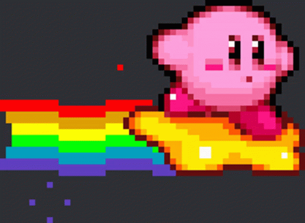

  # Olá, eu sou Victor Santana Santos!

Bem-vindo ao meu repositório! Sou um desenvolvedor apaixonado por programação e desenvolvimento de jogos. Atualmente, estou cursando Técnico em Desenvolvimento de Sistemas na Etec de Embu e trabalhando no meu projeto de TCC, **Floral Anomaly**, um RPG roguelike desenvolvido na Unity.

## Minhas Habilidades

  - **Linguagens de Programação:**
    - C#
    - JavaScript
    - Python
    - MySQL

- **Bibliotecas e Frameworks:**
  - React
  - React Native

- **Desenvolvimento de Jogos:**
  - Unity

## Sobre o Projeto Floral Anomaly

**Floral Anomaly** é um jogo que visa proporcionar reflexão e lazer ao jogador. Você irá explorar uma floresta cheia de desafios, acompanhando a protagonista Flora e seus companheiros Olga, Rush e Carlos.

## Conecte-se Comigo

Você pode me encontrar nas redes sociais e saber mais sobre meu trabalho e projetos em meu [LinkedIn](https://www.linkedin.com/in/victor-santana-81a87b245/).

Sinta-se à vontade para explorar o repositório, fazer perguntas ou contribuir para o projeto. Estou sempre aberto a feedback e colaborações.

